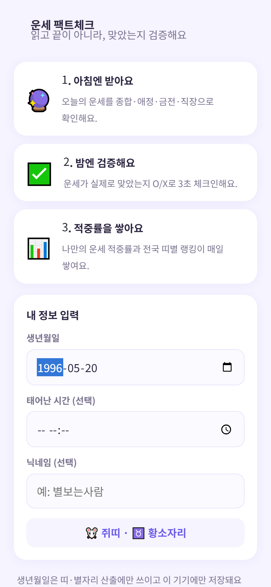
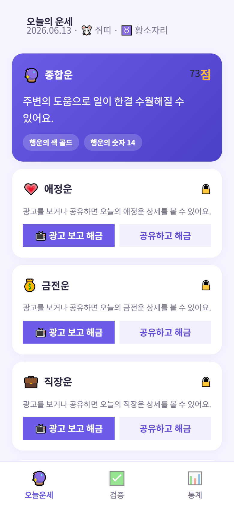
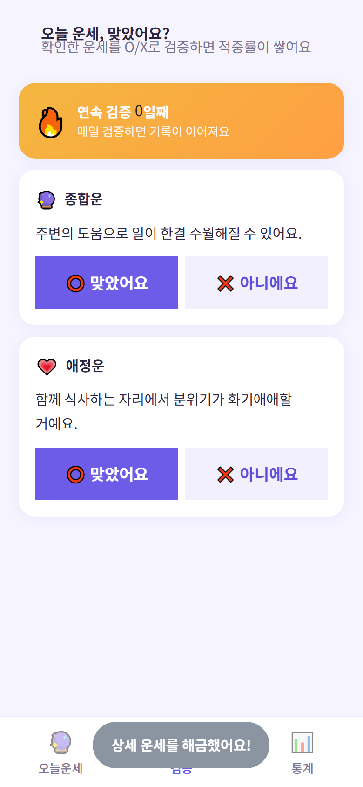
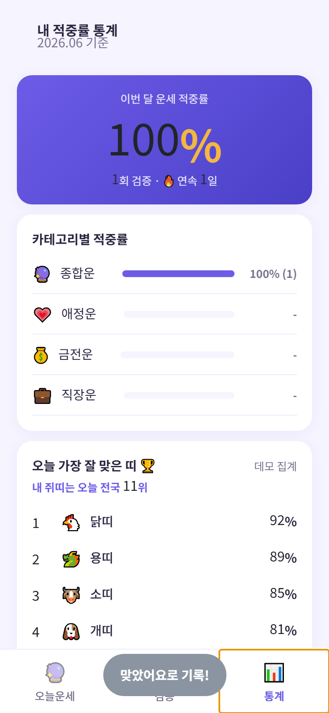
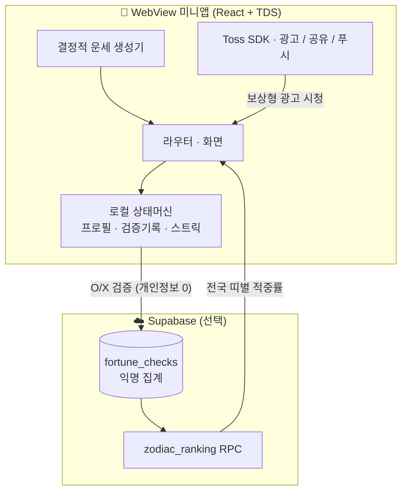

<div align="center">

# 🔮 운세 팩트체크 (Fortune Check)

**아침엔 오늘의 운세를 받고, 밤엔 "실제로 맞았는지" O/X로 검증해 나만의 운세 적중률을 쌓는 앱**

[](https://react.dev)
[](https://www.typescriptlang.org)
[](https://vitejs.dev)
[](https://supabase.com)
[](https://apps-in-toss.toss.im)

토스 앱 속 WebView 미니앱 · 비게임 · 광고 수익형 게이미피케이션

</div>

---

## 📸 스크린샷

| 온보딩 | 오늘의 운세 | 밤 검증 (O/X) | 적중률 통계 |
|:---:|:---:|:---:|:---:|
|  |  |  |  |

---

## 🎯 한눈에 보기

> 아침에 **운세를 받고**(종합 무료 / 상세는 광고·공유로 해금) → 밤에 **맞았는지 O/X로 검증** → **적중률 통계·전국 띠별 랭킹**이 쌓이고 → 다음날 다시 복귀하는 **하루 2세션** 루프.

| | |
|---|---|
| **무엇을** | 운세를 "읽는" 앱이 아니라 "검증하는" 앱 — 적중률이 나만의 누적 자산이 돼요 |
| **어디서** | 토스 앱 내 미니앱 (수천만 토스 유저 노출) |
| **누구를 위해** | 운세 콘텐츠에 익숙한 20~30대 (전 세대 호환) |
| **누가** | 1인 기획·개발 (프론트엔드 + 데이터 설계 + 가상 보상 경제 + 심사/안전 정책) |

---

## ✨ 핵심 기능

- **이중 루프 (아침 받기 → 밤 검증)** — 아침에 확인한 운세만 밤에 검증 가능한 *호혜 잠금*으로 재방문 동기를 만들어요.
- **결정적 운세 생성기** — `날짜 × 띠 × 별자리 × 카테고리`를 시드로 **O/X로 검증 가능한** 문장을 생성(오프라인 동작, 콘텐츠 단가 0).
- **광고 게이트 (선택형)** — 애정·금전·직장 상세운을 보상형 광고 또는 공유로 해금. 강제 광고벽 없음, 보상은 **결정적**(상세 1개 해금).
- **적중률 통계 + 전국 띠별 랭킹** — 월간/카테고리별 개인 적중률 + "오늘 가장 잘 맞은 띠" 랭킹(Supabase 익명 집계).
- **연속 검증 기록(스트릭)** — 매일 검증하면 이어지는 손실 회피 장치 + 마일스톤 칭호.
- **공유 카드 2종** — 오늘의 운세 / 월간 적중률 카드.

---

## 🛠 기술 스택

| 영역 | 사용 기술 |
|---|---|
| **언어** | TypeScript 5.7 (strict) |
| **프론트엔드** | React 18, Vite 6, Emotion |
| **디자인 시스템** | TDS Mobile (토스 디자인 시스템) |
| **플랫폼 SDK** | `@apps-in-toss/web-framework` (Granite 런타임 · WebView 브릿지 · 인앱광고 · 공유 · 푸시) |
| **백엔드(선택)** | Supabase — 익명 인증 · Postgres · RLS · RPC (전국 띠별 랭킹 집계) |
| **수익화** | 인앱 광고(보상형·전면·배너) — 자발적 노출 기반 |
| **품질** | ESLint(flat config), Prettier, Playwright(스크린샷 회귀) |
| **배포** | `ait build` → `.ait` 아티팩트 → `ait deploy` |

---

## 🏗 아키텍처



**설계 의도**
- **개인정보 최소화** — 토스 로그인 없이 **익명 인증**. 생년월일은 **기기 로컬에만** 저장(서버 전송 0). 서버는 `{익명id, 날짜, 띠, 카테고리, O/X}` 집계값만 보관 → 회원탈퇴(연결끊기) 엔드포인트가 불필요.
- **광고는 선택형 게이트** — 사용자가 상세 운세를 위해 자발적으로 시청(강제 광고벽 없음), 보상은 결정적.
- **그레이스풀 디그레이데이션** — 광고/백엔드 키가 없어도 브라우저에서 전체 흐름 동작(전국 랭킹은 결정적 데모 집계로 폴백).
- **시간 경계는 KST** — 일일/연속 기록은 한국시간 기준, 서버 집계는 `now() at time zone 'Asia/Seoul'`.

---

## 💡 엔지니어링 하이라이트

<details open>
<summary><b>1. "읽는 앱"이 아니라 "검증하는 앱" — 이중 루프 설계</b></summary>

> 기존 운세 앱은 아침에 읽고 끝나는 소비형이에요. 여기에 **밤 검증 세션**을 더해 하루 2세션을 만들고, *아침에 본 운세만 밤에 검증 가능한 호혜 잠금*으로 아침 진입 동기를 강화했어요. 검증이 쌓일수록 적중률이라는 **이탈 비용**이 생겨요.
</details>

<details>
<summary><b>2. 검증 가능한 운세를 만드는 결정적 생성기</b></summary>

> "오늘 운이 좋아요" 같은 문장은 O/X 검증이 안 돼요. `날짜×띠×별자리×카테고리`를 시드로 한 결정적 RNG(mulberry32)로 **"오후에 예상 밖 지출이 생길 수 있어요"** 처럼 *검증 가능한 가능성 화법* 문장만 골라요. 같은 날·같은 사람은 항상 같은 결과 → 서버·네트워크 없이 일관성 보장.
</details>

<details>
<summary><b>3. 개인정보 0 설계로 심사 리스크 최소화</b></summary>

> 운세 앱은 보통 생년월일을 서버에 저장하지만, 여기서는 **로컬에만** 저장하고 서버에는 띠(익명)와 O/X만 보내요. 토스 로그인을 쓰지 않아 *추가 정보 수집 → 연결끊기 엔드포인트 필수* 부담을 원천 제거했어요.
</details>

<details>
<summary><b>4. 광고/백엔드 없이도 끊기지 않는 흐름</b></summary>

> `isSupported()` 가드 + 빈 키 즉시 통과로, 광고 그룹 ID나 Supabase 키가 없어도 브라우저 둘러보기에서 온보딩→검증→통계 전 구간이 동작해요. Playwright로 이 전 구간을 스크린샷 회귀 테스트해요.
</details>

---

## 🚀 로컬 실행

```bash
npm install
cp .env.example .env   # 값은 비워둬도 '둘러보기'로 전체 흐름 확인 가능
npm run dev
```
```bash
npm run build   # vite/ait 빌드 → .ait 아티팩트
npm run deploy  # 앱인토스 콘솔로 배포
```

스크린샷 재생성: dev 서버를 띄운 뒤 `node scripts/screenshots.mjs`.

---

## 📂 프로젝트 구조

```
src/
├─ lib/         env · analytics · tossEnv · kst · supabase
├─ hooks/       useAdGate(보상형) · useInterstitialAd(전면)
├─ components/  BannerAd · BottomNav · ScreenLayout
├─ data/        fortune(생성기) · zodiac(띠·별자리) · ranking · notify · share
├─ features/    onboarding · home · verify · stats
├─ state.tsx    localStorage 상태머신 (프로필 · 검증기록 · 스트릭)
└─ router.tsx   URL 없는 스택 라우터
scripts/        Playwright 스크린샷
submission/     심사 제출 자료(앱 정보 · 아이콘 600×600 · 썸네일 1932×828)
```

---

## 🗺 로드맵

- [ ] 광고 그룹 ID 연결 → 수익화 활성화
- [ ] 아침 운세 / 밤 검증 데일리 리마인드 푸시(스마트 발송) 운영
- [ ] LLM 주간 배치로 운세 콘텐츠 풀 확장 + 수동 검수 파이프라인
- [ ] 지표 안정화 후 검증 스트릭 보너스를 토스포인트로 전환(서버 user-key 중복지급 방지)

---

<div align="center">

**개인 포트폴리오 목적으로 공개한 저장소예요.**
앱인토스 비게임 미니앱 · 게이미피케이션·광고 수익 설계 · 심사/개인정보 정책까지 1인 개발한 사례예요. 🔮

</div>
